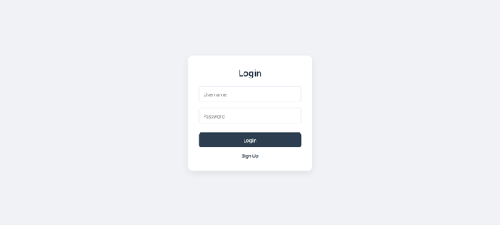
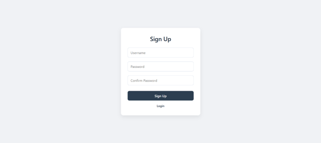
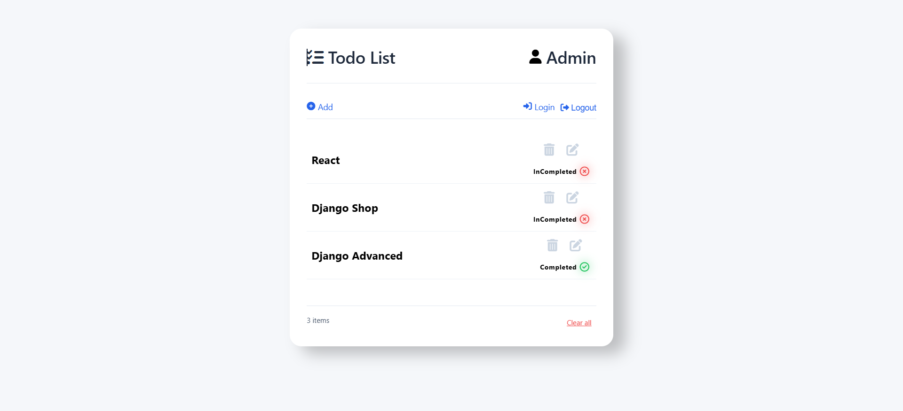
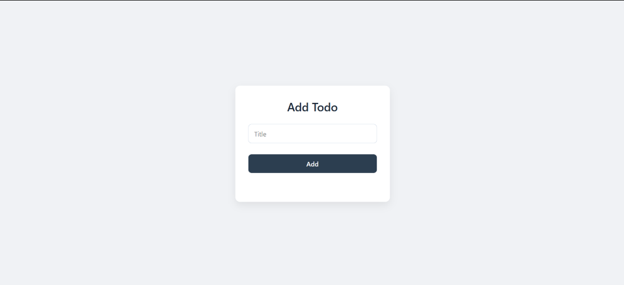
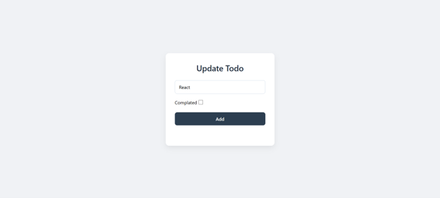
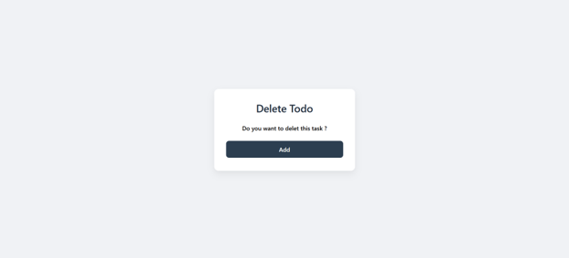
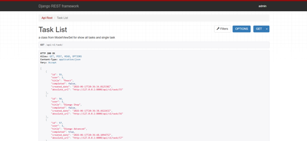

# CBV-DRF Todo App


A Todo Application built with **Django**, **Class Based Views (CBV)** and **Django REST Framework (DRF)**.

This project demonstrates how to build a complete Todo Management System with:

- User Authentication
- Task CRUD Operations
- Django CBVs
- RESTful APIs
- Pagination
- Custom Permissions
- Automated Testing with Pytest
- Code Quality Checks with Flake8

---

## Features

### Authentication

- User Registration
- User Login
- User Logout
- User-specific Tasks

### Todo Management

- Create Task
- Update Task
- Delete Task
- List Tasks
- Mark Tasks as Completed
- Filter User Tasks

### API Features

- RESTful Endpoints
- Serializer Validation
- Custom Permissions
- Pagination
- API Versioning (`v1`)

### Testing

- API Testing using Pytest
- Unit Tests

### Development Tools

- Flake8 Linting
- Custom Django Management Commands

---

## Technologies Used

- Python
- Django
- Django REST Framework
- SQLite
- HTML
- CSS
- JavaScript
- Pytest
- Flake8

---

## Project Structure

```text
accounts/
├── api/v1/
├── models.py
├── views.py
├── forms.py

todo/
├── api/v1/
│   ├── serializers.py
│   ├── permissions.py
│   ├── paginations.py
│   └── views.py
│
├── management/commands/
│   └── insert_data.py
│
├── test/
│   └── test_todo_api.py
│
├── models.py
├── views.py
└── forms.py

templates/
├── registration/
└── todo/

staticfiles/
├── css/
└── js/
```

---

## Installation

Clone the repository:

```bash
git clone https://github.com/Ali-Arezoomandi/CBV-DRF-TodoApp.git
```

Move into the project directory:

```bash
cd CBV-DRF-TodoApp
```

Create virtual environment:

```bash
python -m venv venv
```

Activate virtual environment:

Windows

```bash
venv\Scripts\activate
```

Linux / Mac

```bash
source venv/bin/activate
```

Install dependencies:

```bash
pip install -r requirement.txt
```

Apply migrations:

```bash
python manage.py migrate
```

Create superuser:

```bash
python manage.py createsuperuser
```

Run server:

```bash
python manage.py runserver
```

---

## API Endpoints

### Authentication

| Method | Endpoint                 |
| ------ | ------------------------ |
| POST   | /api/v1/accounts/signup/ |
| POST   | /api/v1/accounts/login/  |

### Tasks

| Method | Endpoint           | Description   |
| ------ | ------------------ | ------------- |
| GET    | /api/v1/task/      | List Tasks    |
| POST   | /api/v1/task/      | Create Task   |
| GET    | /api/v1/task/<id>/ | Retrieve Task |
| PUT    | /api/v1/task/<id>/ | Update Task   |
| DELETE | /api/v1/task/<id>/ | Delete Task   |

---

## Running Tests

Run all tests:

```bash
pytest .
```

Run specific test file:

```bash
pytest todo/test/test_todo_api.py
```

---

## Code Quality

Check code style:

```bash
flake8 .
```

---

## Custom Management Command

Insert sample data:

```bash
python manage.py insert_data
```
---

## Screenshots

### Authentication

<p align="center">
  
  
</p>

### Task Management

<p align="center">
  
  
</p>

<p align="center">
  
  
</p>

### REST API

<p align="center">
  
</p>

---

## Future Improvements

- JWT Authentication
- Docker Support
- Swagger Documentation
- Search & Filtering
- Celery Background Tasks
- PostgreSQL Integration

---

## Author

**Ali Arezoomandi**

GitHub: https://github.com/Ali-Arezoomandi

Email: [ali.arezoomandi1723@gmail.com](mailto:ali.arezoomandi1723@gmail.com)
